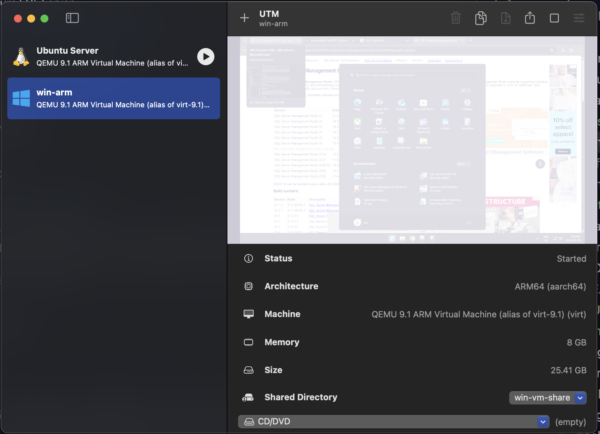
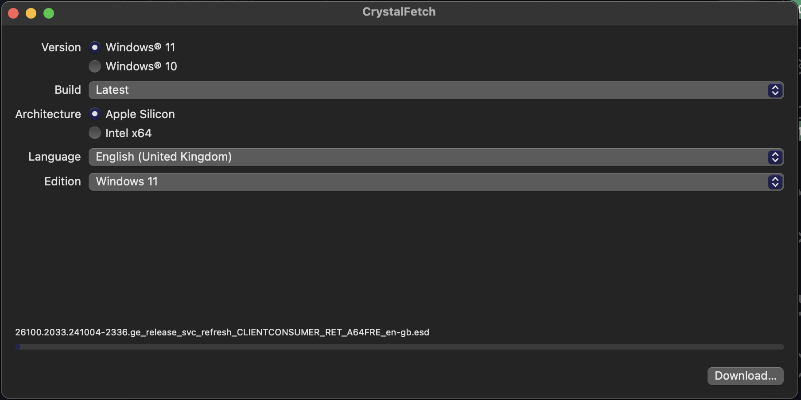
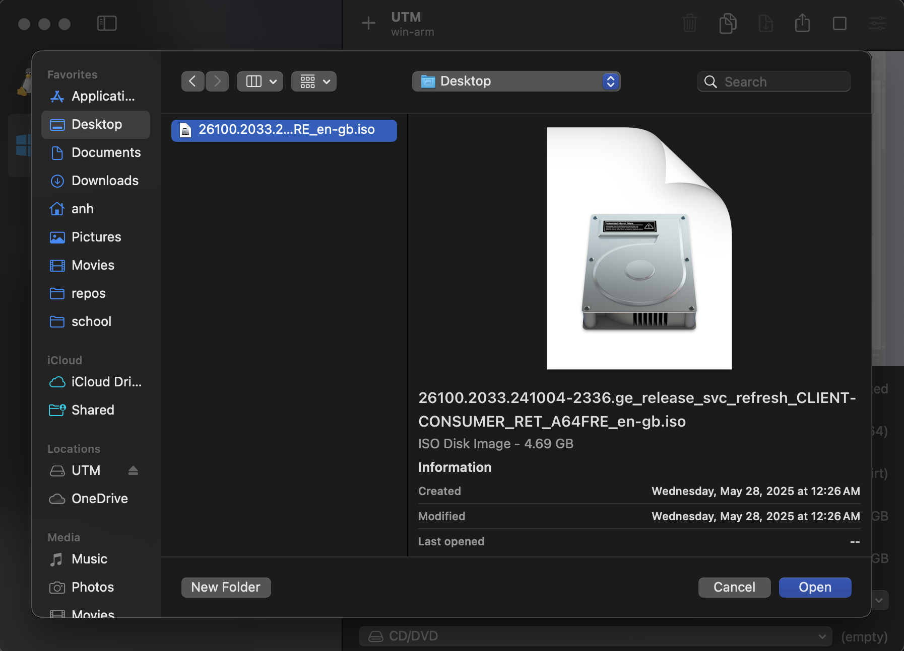
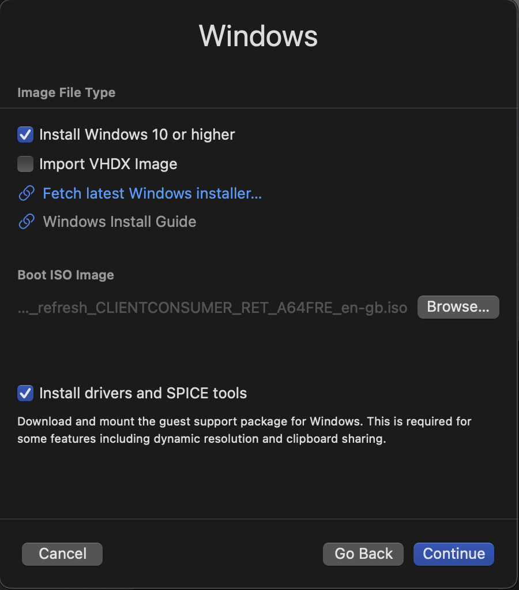
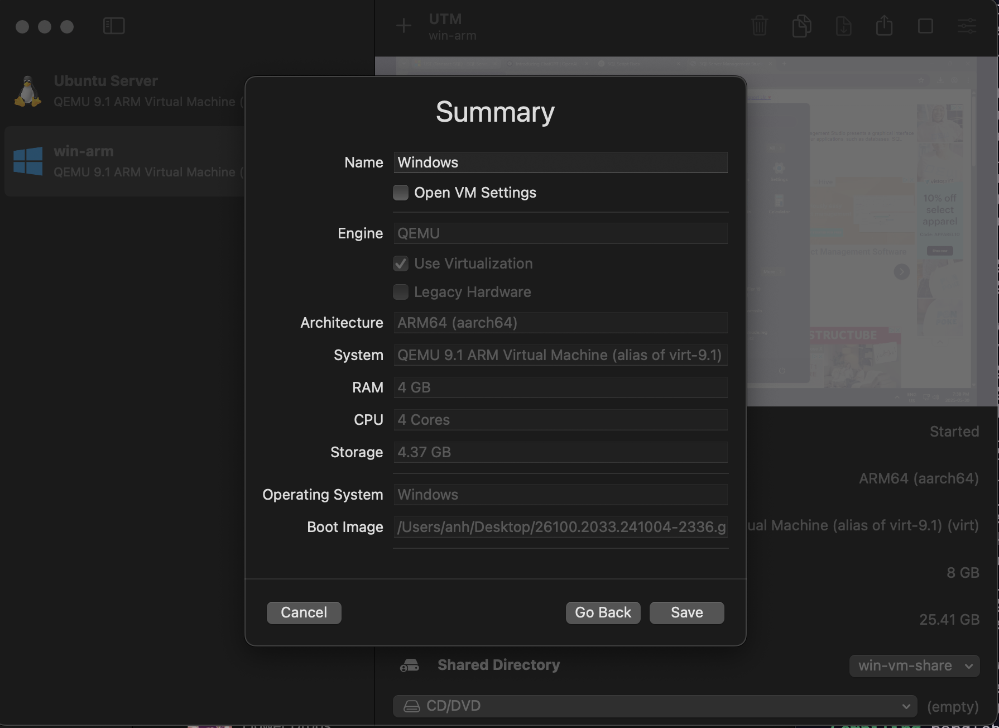
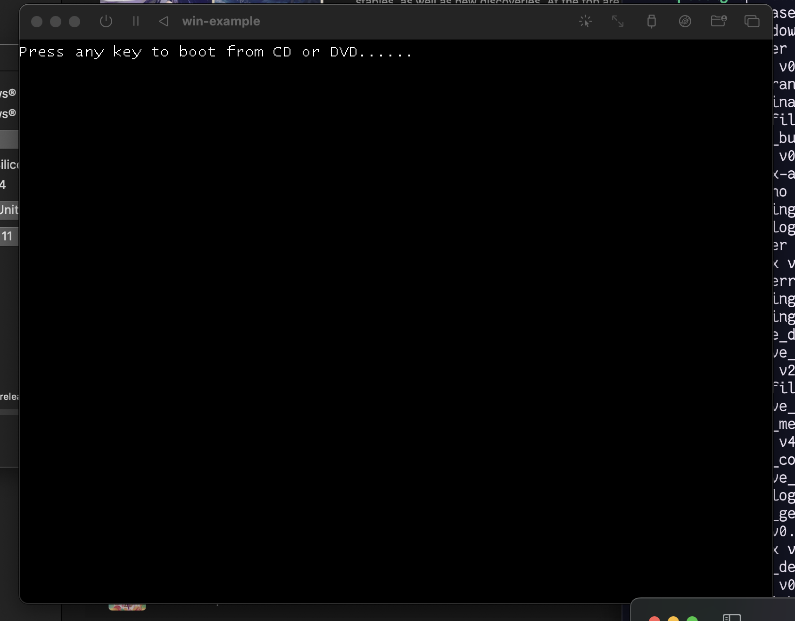
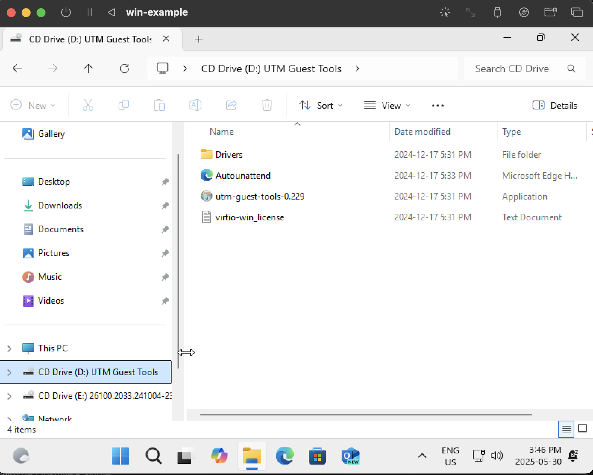
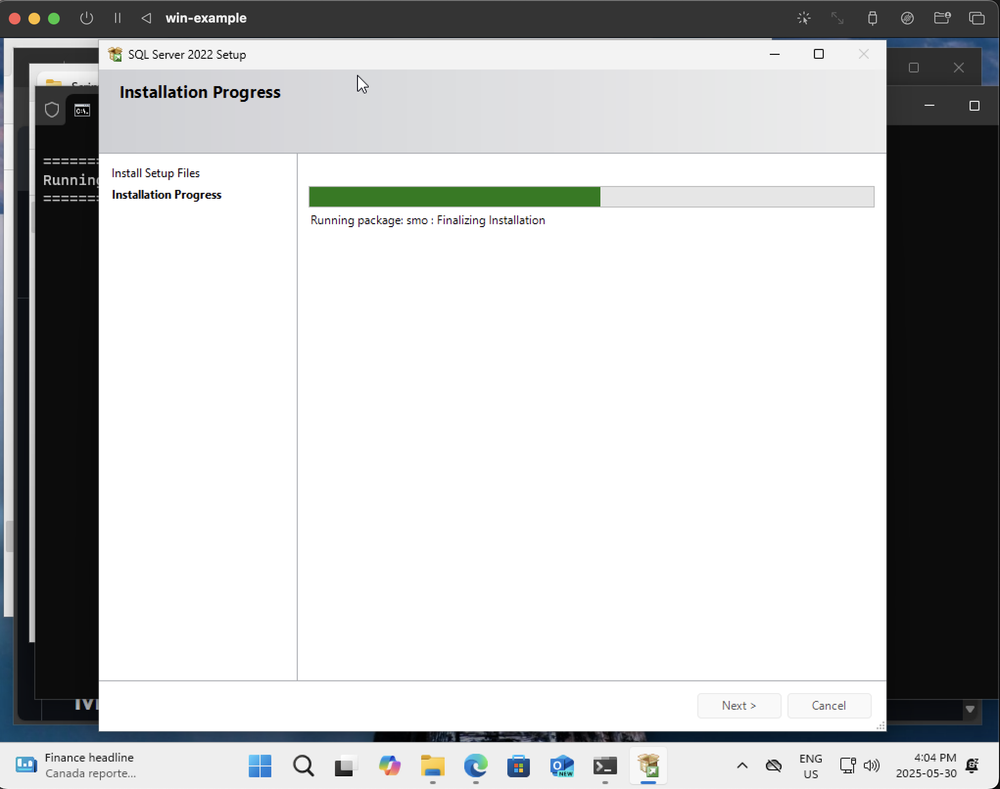
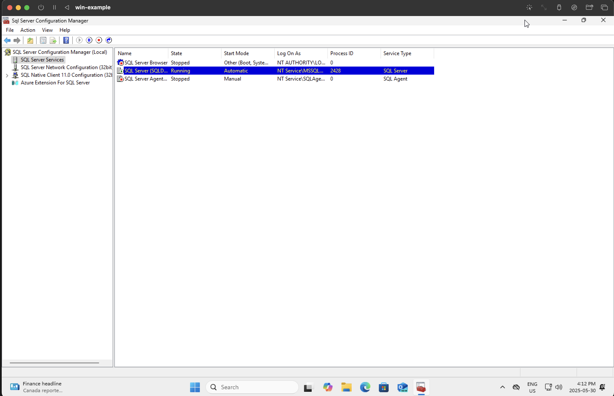

# Microsoft SQL Server + Studio on macOS ARM64

## Introduction

<blockquote class="warning">This is a EXTREMELY LONG procedure from start to finish, so make sure you are able to dedicate 3-4 hours, depending on how familiar you are with stuff and how fast your Mac is, to go through them.

You may use your Mac during the process.
</blockquote>

These are the step-by-step instructions for getting the Microsoft SQL Server and Studio on an ARM64 (aarch64) macOS device.

Supported versions:
- SQL Server <= 22
- SQL Management Studio:
  - 19 (tested - ✅)
  - 22 (tested - ❌)

> It is highly recommended that you use a Windows x86 64-bit machine to natively run the MSSQL stack if possible to save time and effort. This solution should be a last resort.

## Overview

1. Install UTM
2. Create Windows ARM64 virtual machine
   1. Install CrystalFetch
   2. Download Windows ARM64 iso image
3. Install Windows
4. Use install script from <https://github.com/jimm98y/MSSQLEXPRESS-M1-Install> to install SQL Server
5. Configure SQL Server
6. Install SQL Management Studio from <https://download.microsoft.com/download/7/7/3/7738e337-ed99-40ea-b8ae-f639162c83c3/SSMS-Setup-ENU.exe>
7. Start SQL Management Studio

## Install UTM

### Installation

- <https://mac.getutm.app/>
- Click on Download button
- Save the `.dmg` to a location on your Mac device. E.g. Downloads
- After downloading, double click on `UTM.dmg` to mount the disk image
- Drag and drop the `UTM.app` to `Applications` folder
- Installation complete

  <h3>What is UTM?</h3>
  

  UTM is an emulator and virtual machine host/manager. The underlying technology is called QEMU, which is open-source and widely used in the industry as the emulation and virtualization backend.
  

## Create a Windows ARM64 virtual machine in UTM (Part 1)

> DO NOT START FROM THE MOUNTED DISK IMAGE.

1. Start UTM by either from Spotlight search or from Applications folder
2. Click Yes/Continue/Ok when the macOS security prompt appears
3. You will be presented with the UTM window (screenshot, but empty)

1. Click on the plus icon at the top of the window
2. Creation dialog appears
3. Select Virtualize option
4. Select Windows
5. Click on `Fetch latest Windows installer` link

### Using the CrystalFetch app

6. Download, install and open the CrystalFetch app
7.  Keep default options as-is
8.  Select your preferred Language. E.g. `English (United Kingdom)` to avoid logging in with Microsoft account
9.  Select `Windows 11` as the Edition
10. Click on `Download...` button

## Create a Windows ARM64 virtual machine in UTM (Part 2)

11. After CrystalFetch finishes downloading, go back to the UTM dialog
12. Under Boot ISO Image, click on `Browse...` to select the downloaded ISO image

13. Make sure `Install drivers and SPICE tools` is checked
14. Click `Continue`
15. Allocate memory to the VM, select at least 50% of Mac device memory. E.g. 8192 MiB on a 16 GB Mac
16. Allocate CPU cores to the VM, select at least 50% of performance cores on Mac device. E.g. 4 Cores on a 10-core Mac (8 performance cores, 2 efficiency cores)
17. Click `Continue`
18. Storage size should be at least 80 GB
19. Click `Continue`
20. No need to configure Shared Directory
21. Click `Continue`
22. On Summary page, click `Save`

## Install Windows

1. Boot up the created Windows virtual machine by clicking on the play button next to the entry in the list
2. PAY ATTENTION, when you see the `Press any key to boot from CD/DVD`, press `Enter` or any key. This is only necessary for this step, ignore on future restarts.

3. Windows installer will now start booting. You should see the Windows loading animation.
4. Once the installer is loaded, leave language settings as-is, click `Next`
5. Select `US` as input method, or Canadian French or Canadian Multilingual Standard where applicable, click `Next`
6. Select `I don't have a product key` link at the bottom
7. Select `Windows 11 Pro`, click `Next`
8. On EULA screen, Click `Accept`
9.  On Select Location to install screen, leave as-is, click `Next`
10. Wait for the installation to be done.
11. The virtual machine will automatically restart **several times**

## Windows setup after installation

1. You should now be looking at the (white) Windows setup screen
2. Select region: Canada in this case, click `Yes`
3. Select keyboard layout: US or Canadian, click `Yes`
4. Select second keyboard layout: click `Skip`
5. Windows setup should now start installing additional updates if applicable
6. Create a local user account with name, username and password
7. Setup should now start installing updates (again 🤡 because MSFT devs and product managers are *mostly* dumb-dumb, but not me). Will take a while depending on your internet connection.
8. After which, it will restart several times again, as if it doesn't want you to use the crappy software, then log in and you should be at the Desktop

### Install drivers and tools

1. Open Explorer (yellow folder icon on the Taskbar)
2. On sidebar, select `UTM Guest Tools` drive

3. Double-click on the `utm-guest-tools-<version-number>` installation application
4. On the installer window, click `Next`, `I agree`
5. Wait for the installation to complete

## Install MSSQL Server + Studio

### MSSQL Server

> For convenience, reopen this instruction website on the virtual machine browser (MS Edge)

1. In the virtual machine, open a browser and open this link <https://github.com/jimm98y/MSSQLEXPRESS-M1-Install/archive/refs/heads/main.zip>
2. After the zip file is downloaded, extract it
3. Navigate into the extracted folder: e.g. `MSSQLEXPRESS-M1-Install-main\MSSQLEXPRESS-M1-Install-main\src\Scripts`
4. Double-click on `Sql2022Developer.bat` script file
5. On the Windows protected your PC popup, click `More info` link
6. Click `Run anyway`
7. Wait for the installation to complete (around 30 minutes)

8. After it finishes, start the Sql Server Configuration Manager to verify the SQL Server Services is running (screenshot below)

9. You can close the app, the services are running in the background.

### MSSQL Studio

1. Download MSSQL Studio 19 installer from here: <https://download.microsoft.com/download/7/7/3/7738e337-ed99-40ea-b8ae-f639162c83c3/SSMS-Setup-ENU.exe>
2. Double-click to start the installer, will take longer than expected to start. This is because it is running through the architecture translation layer.
3. You're now seeing the setup window.
4. Leave the default location and click on `Install`
5. Wait for the installation to complete.
6. Close the setup to finish.

## Start MSSQL Studio 19

In the Windows start menu, there should ne MSSQL Management Studio 19 shortcut. Click on that to start. Will take a moment to start.

Leave the Connect to Server dialog fields as-is and click on Connect.

Done.